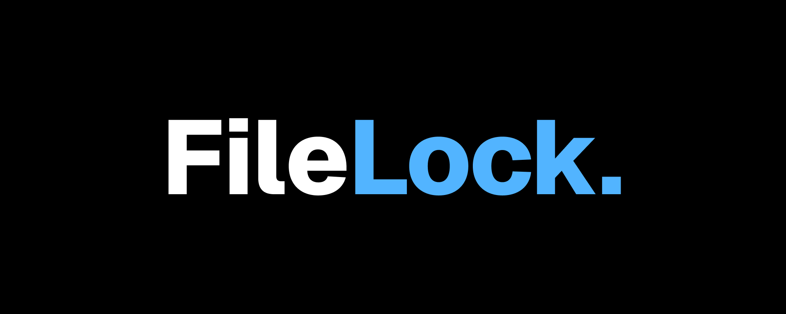

# FileLock

FileLock is a command-line tool for securely encrypting and decrypting files using AES-256 encryption and SHA-256 integrity verification. Built with Python, it’s a lightweight, open-source utility designed to protect sensitive data with a password.



## Purpose

In a world where data security is critical, FileLock provides a lightweight, open-source solution to encrypt files with a password of your choice. Whether it’s a personal document or a configuration file, FileLock ensures your data stays confidential using industry-standard cryptography.

## Features

- Encryption: Encrypt files with AES-256 in CBC mode, using a password-derived key via PBKDF2.
- Decryption: Restore encrypted files to their original state with the correct password.
- Integrity Verification: Uses SHA-256 hashing to detect tampering or corruption.
- CLI Interface: Easy-to-use command-line interface with clear arguments and error handling.
- Cross-Platform: Works on Windows, Linux, and macOS with minimal setup.

## Installation

**FileLock** requires Python 3.9+ and one external library. Here’s how to set it up:

Clone the repository:

```bash
git clone https://github.com/yourusername/filelock.git
cd filelock
```

Install dependencies:

```bash
pip install pycryptodome
```

Run the tool:

- On **Unix-like systems (Linux/macOS)**: `./filelock.py`
- On **Windows** or others: `python filelock.py`

## Usage

FileLock currently supports encrypting files. Here’s how to use it:

### Encrypt a File

Encrypt a file with a password:

```bash
python filelock.py encrypt <file> --password "<your_password>"
```

The encrypted file **(**`<file>.flk`) contains the salt, initialization vector (IV), and encrypted data.

### Decrypt a File

Decrypt an encrypted file with the original password:

```bash
python filelock.py decrypt <file> --password "<your_password>"
```

### Error Handling

- File not found
- Wrong password
- Tampered file

## Help

```bash
python filelock.py --help
```

## Design Decisions

- AES-256 CBC: Industry-standard encryption with CBC mode for block-level security, paired with a random IV to ensure uniqueness.
- PBKDF2 Key Derivation: Turns your password into a secure 32-byte key with 100,000 iterations and a 16-byte salt, resisting brute-force attacks.
- SHA-256 Integrity: Hashes the original file during encryption and verifies it on decryption, catching tampering or corruption.
- File Format: Encrypted output (`<file>.flk`) bundles salt (16 bytes), IV (16 bytes), hash (32 bytes), and encrypted data into one portable file.
- PEP 8 Compliance: Code follows Python’s style guide for readability and professionalism.

## Contrubuting

This is a personal project for my portfolio, but feel free to fork it and experiment! Suggestions are welcome—open an issue if you spot something to improve.

## Acknowledgements

Built as a showcase for skills in cybersecurity, system design, and Python development.

**Last Updated:** 27-02-2025 ⸺ **Last Reviewed:** 27-02-2025
